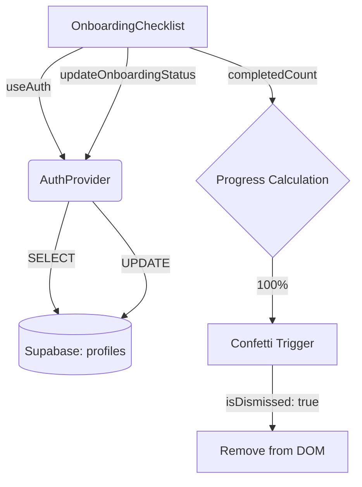

# Onboarding Checklist Component

The `OnboardingChecklist` is a premium, AI-native guidance component designed specifically for **Persona A (Beginners)**. It provides a non-intrusive, delightful setup experience that ensures new users reach their "Aha!" moment by completing three core financial tasks.

## 1. Component Overview

- **Design Language**: Modern Fluidity (Glassmorphism).
- **Surface**: `bg-white/80` with `backdrop-blur-xl`.
- **Primary Logic**: Persistent state tracking via Supabase.
- **Visual Feedback**: Real-time SVG progress circle and `canvas-confetti` celebration.

## 2. Technical Architecture

The component is highly integrated with the `AuthProvider` to ensure that onboarding progress is saved across sessions and devices.



### State Management
- **`status`**: Derived from `userData.onboardingStatus`. Defaults to all `false` if not set.
- **`progress`**: Calculated dynamically based on the number of `true` values in `status.steps`.
- **`isMinimized`**: Local UI state to allow users to tuck the checklist away without dismissing it.

## 3. Visual & Animation Logic

We use **Framer Motion** for all transitions to maintain a premium, fluid feel.

| Feature | Logic | Token/Effect |
| :--- | :--- | :--- |
| **Entrance** | `initial: { y: 20, opacity: 0 }` | Slide up & Fade |
| **Progress** | `strokeDashoffset` animation | Spring (`damping: 20`) |
| **Glow** | `animate: { opacity: [0.3, 0.5, 0.3] }` | Pulsing Mesh |
| **Completion** | `canvas-confetti` | High-burst (150 particles) |

## 4. Consumer Guide

### Integration
Place the component inside any "main" scrollable area. It automatically handles its own visibility.

```tsx
import { OnboardingChecklist } from '@/components/onboarding-checklist';

export const MyDashboard = () => (
  <main>
    <Header />
    <OnboardingChecklist /> 
    <Content />
  </main>
);
```

### Task Definitions
Current tasks are hardcoded in `ONBOARDING_TASKS` for visual consistency:
1. **`wallet`**: Create First Wallet.
2. **`transaction`**: Log Today's Transaction.
3. **`goal`**: Set a Savings Goal.

---

> [!IMPORTANT]
> To ensure the confetti works correctly, the `canvas-confetti` package must be installed as a dependency.

> [!TIP]
> Use the **"Atur Ulang Onboarding"** button in the Settings page to reset the `onboarding_status` in the database for testing purposes.
